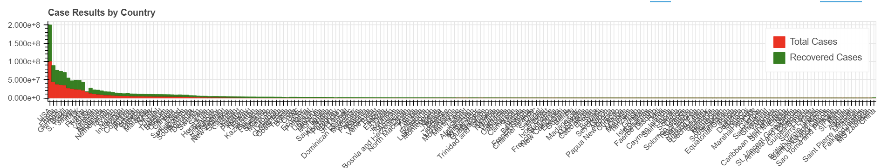
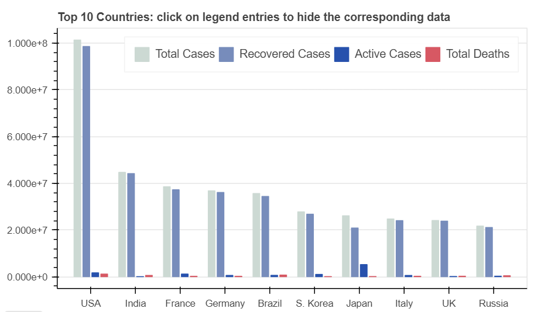
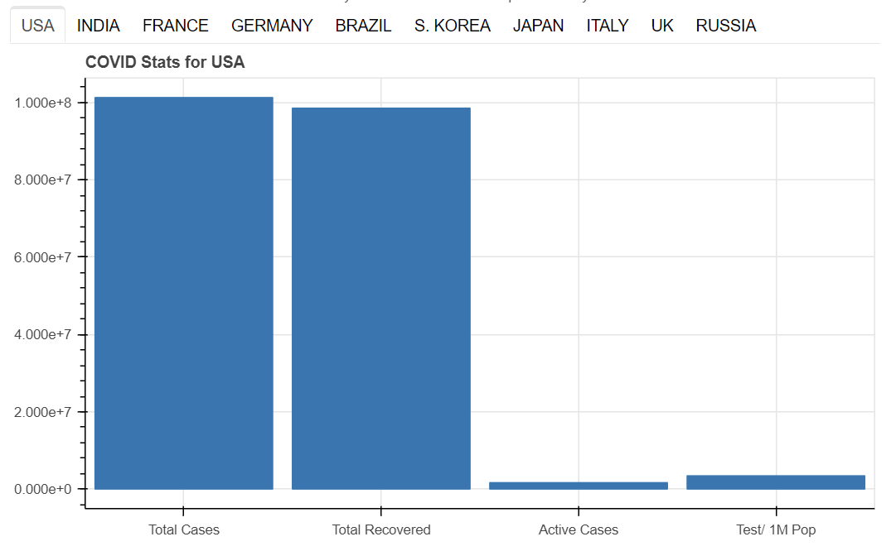
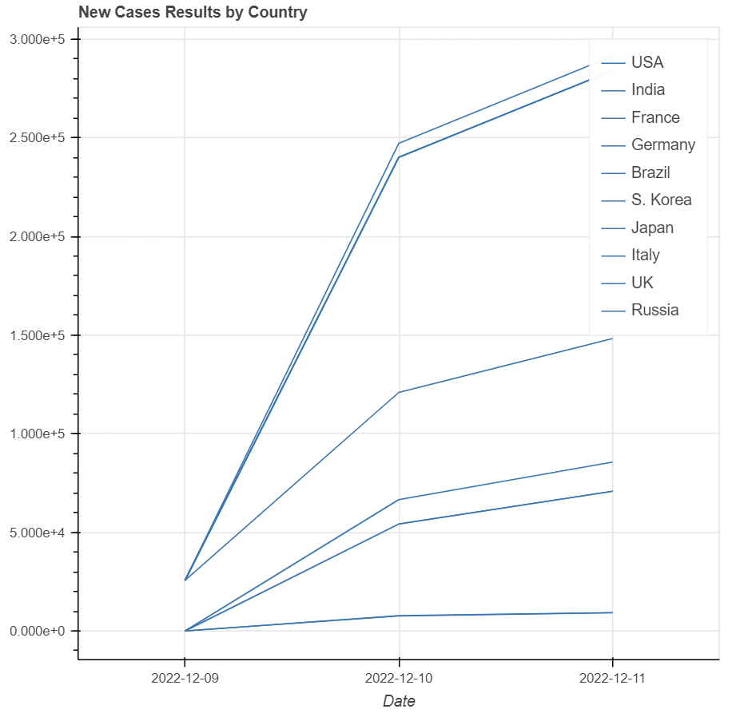

# Covid-Dashboard
COVID Dashboard
by: Trevor, Elle, Josh

This program scrapes data from https://www.worldometers.info/coronavirus/ and displays it in a GUI for easy reading and interpretation. 

## Part One
For this part of the assignment, we were ask to commit code that successfully scrapes COVID death data from the web. We have also made a function, scrape_country, that asks accepts a URL and country name which outputs a list with death data for the chosen country. Example of how to use the function:

First parameter is the URL. Note, this function only works with 'https://www.worldometers.info/coronavirus/#countries', any other URL will not work.
Second parameter is the name of the country. Note, the name you input needs to follow the same spelling that is included on the previously mentioned website. An example of this is South Korea. The table on the website lists South Korea as 'S. Korea', using anything else will not return anything from the function.

scrape_country('https://www.worldometers.info/coronavirus/#countries', 'USA')

The output of this function is a list of floats that follow this form:

[cumulative deaths, cumulative deaths per million, new deaths today, new deaths today per million]

This function also saves a .json that includes all the Country COVID data retreived from the Worldometer website. It follows a format that when used with other code will give the user a dictionary that uses country names as the key.

## Part Two
### World Bar Plot
The first plot shown on the page is a "Big Picture" view of COVID statistics from around the world. For every country included on the source URL's site, there is the total cases and the total recovered cases. At first glance, it is a lot to see so we added a scroll wheel zoom and pan tool that is usable on this plot. To use it, simply click the "Pan (x-axis)" and "Wheel Scroll (x-axis)" button at the top right of the plot.

### Top Ten Bar Plot
The first top ten plot shows a summary of the stats associated with the top ten countries in the world. It is desgined to allow the user to compare stats in a 'big picture' view. 

Like the previous plot, this plot shows more detailed stats for the top ten countries in the world. This view is tabulated and the user can cycle through countries by clicking their associated tab above it.

### Top Ten Historical Plot
Finally, the last plot shows the past two days of COVID data for the same ten countries.

